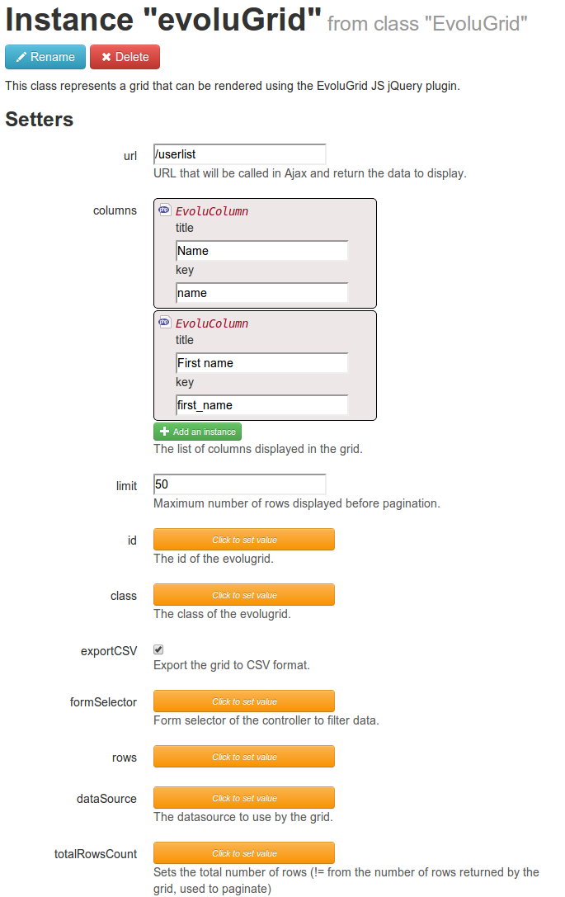

Using Evolugrid in PHP
======================

Evolugrid comes with a number of PHP classes.
Those PHP classes can be used to generate the Javascript and the JSON data.

They can be used with or without the Mouf framework.

Using Evolugrid in plain PHP
----------------------------

###Generating the HTML/JS for the Evolugrid

```php
$evoluGrid = new EvoluGrid();
$evoluGrid->setUrl('/path/to/dataset'); // Set the Ajax URL to be called

// You can configure parameters via setters:
$evoluGrid->setLimit(100); // Set the maximum number of rows displayed
$evoluGrid->setId('myGridId'); // Set the HTML ID of the grid
$evoluGrid->setClass('table'); // Set the CSS class of the grid
$evoluGrid->setExportCSV(true); // Whether CSV export is available

// Outputs the HTML and Javascript to display the grid.
$evoluGrid->toHtml();
```

###Generating the JSON dataset

The EvoluGrid can also help you return the dataset (and the column model associated).
This code should be returned to the Ajax call of Evolugrid:

```php
$evoluGrid = new EvoluGrid();

// Let's add simple columns
$evoluGrid->addColumn(new SimpleColumn("Name", "name"));
$evoluGrid->addColumn(new SimpleColumn("Date", "date"));

// Let's add a column with Javascript rendering
$nameCol = new SimpleColumn("First name", "first_name");
$nameCol->jsrenderer = 'function(row) { return $("<a/>").text(row["first_name"]).attr("href", "'.ROOT_URL.'admin/client/edition.php?id="+row.id) }';
$evoluGrid->addColumn($nameCol);

$data = array(
	0=>array(id=>1, "name"=>"Doe", "first_name"=>"John", "date"=>"12/12/12"),
	1=>array(id=>2, "name"=>"Smith", "first_name"=>"Jim", "date"=>"04/01/13"),
);

// You should return only the pages to be displayed.
$evoluGrid->setRows($obj);

// The total number of rows (used to know how many pages of results are returned.
$evoluGrid->setTotalRowsCount(42);

// Triggers the display of the JSON message
$evoluGrid->output();
```

Note: Evolugrid will pass a number of GET parameters in the Ajax request:

- limit: the maximum number of rows your Ajax callback should return 
- offset: the offset in the dataset where you should start returning data
- output: this is either "json" or "csv". If "csv", it means the user clicked the export button and is expecting a CSV dataset. 

####Exporting CSV instead of JSON

If you select the exportCSV feature, an export button will appear in the grid.

Evolugrid can help you generate the CSV for almost no additional cost.
All you have to do it pass 2 more arguments to the "output" method:

```php
// This will trigger a CSV file download when the user clicks the export button in Evolugrid.
$evoluGrid->output($_GET['output'], 'filename.csv');
```


Using Evolugrid with Mouf
-------------------------

If you are using Mouf (you should!), you can configure most of the grid graphically.
Here is a sample instance:



As you can see, you can directly configure the columns, the Ajax callback, whether or not you want CSV exports, etc...

###Inserting an evolugrid declared in Mouf in your code

Inserting an evolugrid declared in Mouf in your code is a simple line of code:

```php
Mouf::getMyEvoluGrid->toHtml();
```

This will render the evolugrid in your page.

###Implementing the Ajax response

Assuming you are using the Splash MVC framework, your controller would look like this:

```php
class MyController extends Controller {

	...

	/**
	 * @URL /userlist
	 */
	public function userlist($limit=null, $offset=null, $output="json") {
		// Retrieve the rows in database
		$rows = $this->getData($limit, $offset);
		
		$evoluGrid = Mouf::getMyEvoluGrid();
		
		// You should return only the pages to be displayed.
		$evoluGrid->setRows($obj);
		
		// The second parameter is the download name of the file generated (should the user
		// click on the "export" button).
		// The output method can generate the JSON or the CSV output.
		$evoluGrid->output($output, "filename.csv");
	}
}
```
